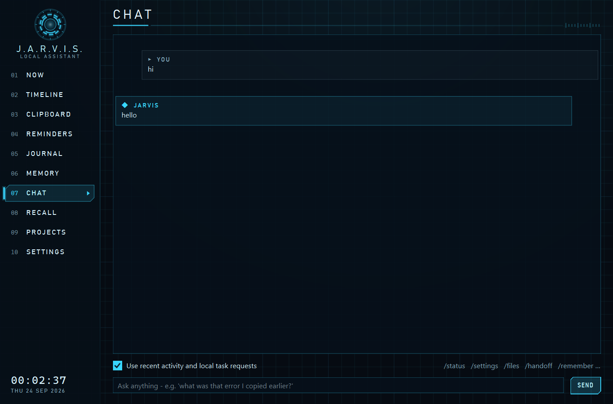
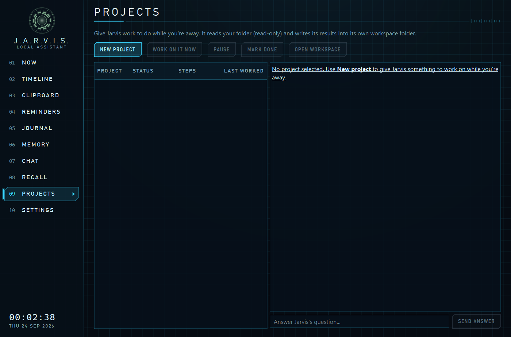
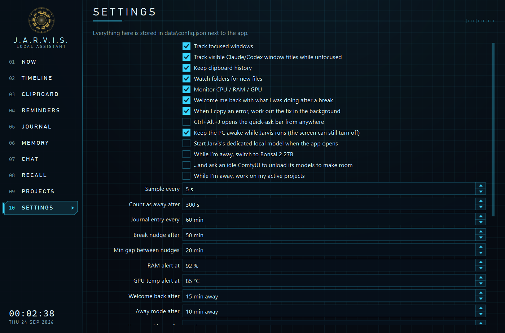

# Jarvis Assistant — UI gallery

Jarvis Assistant is Shawn's local Windows assistant. This repository holds screenshots of its current desktop interface; the application source and local data are not included.

The images were captured from an isolated UI test instance on 2026-09-24. Activity, memory, and chat entries shown here are synthetic. The local model was not loaded for these captures.

## Mission console

## Continuity

Memory Core controls what Jarvis recalls, which activity and task signals it uses, when Bonsai 8B may consult Claude or Codex, and how it replies. New durable facts proposed by 8B wait for Shawn to review them.

## Away work and controls

Projects currently work from an explicit goal in a bounded local workspace. Learning an objective from other apps and carrying it into autonomous away work is still in development. The model was not loaded for these screenshots, so the gallery does not demonstrate a live AI consultation or memory proposal.
