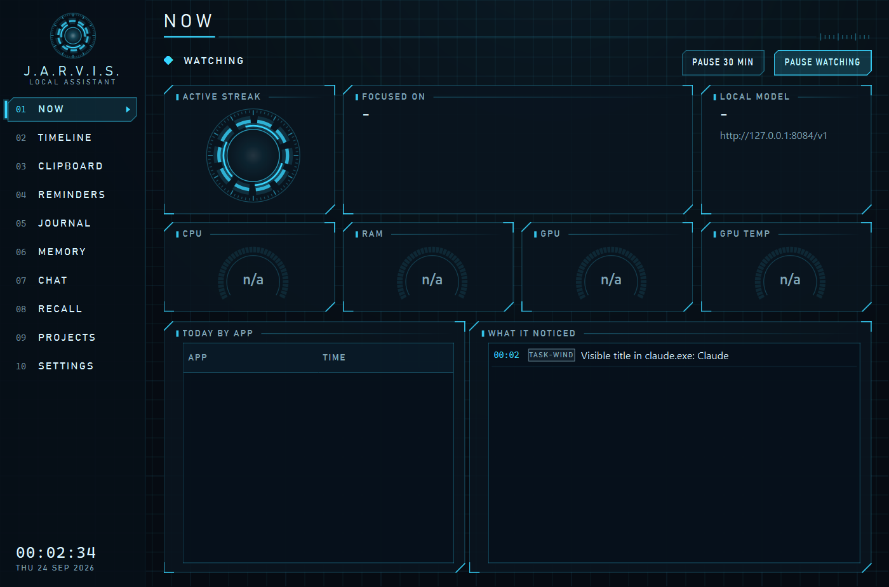
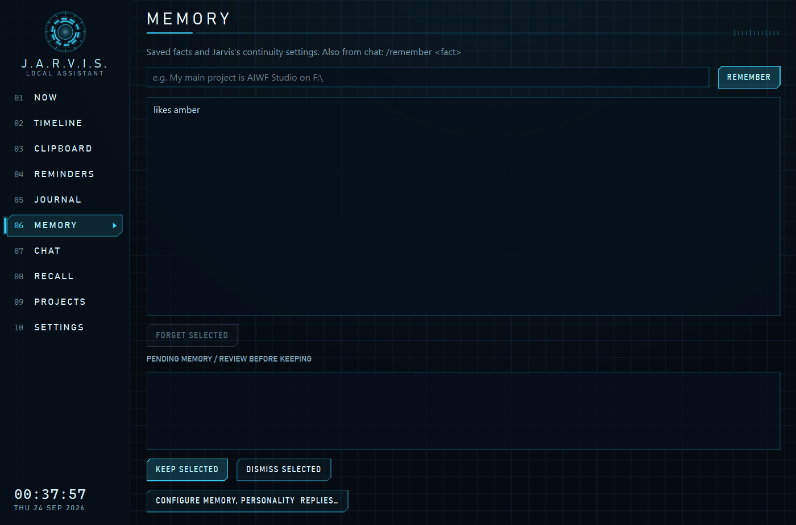
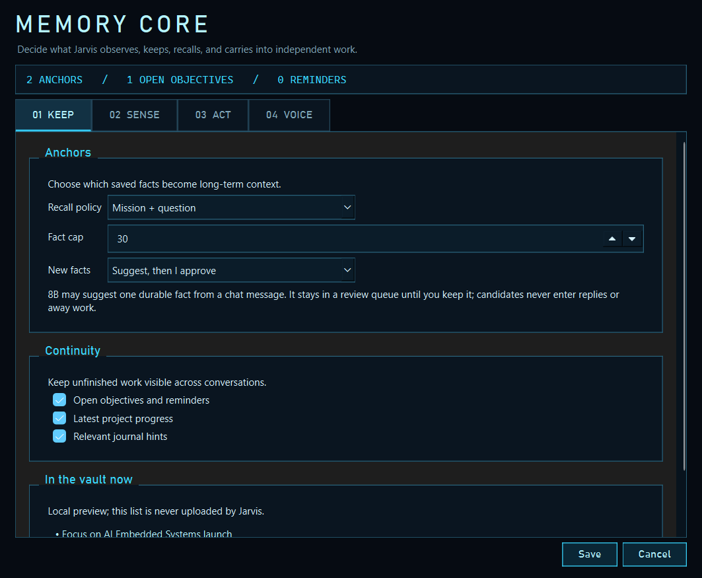
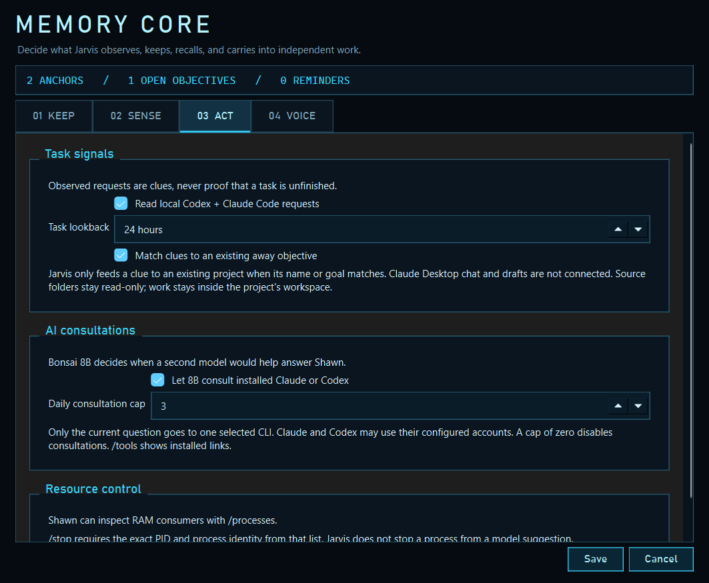

# J.A.R.V.I.S. Assistant

A persistent Windows tray assistant for Shawn's AI Embedded Systems work. Jarvis tracks selected local activity, keeps explicit memory and objectives, answers through a local model, and can continue bounded project work while Shawn is away. The HUD is built with PySide6.

## Models

| Role | Model | Current use |
|---|---|---|
| Conversation, memory suggestions, consultation routing | [Ternary Bonsai 8B GGUF](https://huggingface.co/prism-ml/Ternary-Bonsai-8B-gguf) | Small local model; configured for 16K context. |
| Away work | [Ternary Bonsai 2 27B GGUF](https://huggingface.co/prism-ml/Ternary-Bonsai-2-27B-gguf) | Larger model; configured for 32K context when enabled. |

The configured PQ2_0 files use [PrismML's llama.cpp build](https://github.com/PrismML-Eng/llama.cpp). Model weights and the inference server are not included in this repository. The current settings use Q8 K/V cache; [PrismML describes Q4 KV as experimental](https://github.com/PrismML-Eng/Bonsai-demo/blob/main/KV-CACHE.md).

## What the app does

- **Now:** mission, memory and tool status, current focus, system gauges, and recent events.
- **Memory Core:** KEEP / SENSE / ACT / VOICE controls for recall, observation windows, consultations, and reply style. Bonsai 8B can propose facts from Shawn's chat; suggestions need review before joining long-term memory.
- **Chat and tools:** `/status`, `/settings`, `/files`, `/objectives`, `/tools`, and `/processes` report bounded local state. `/status` checks the configured model endpoint and gives a sanitized reason when it is unavailable. `/stop PID IDENTITY` acts only on an explicitly selected process. Bonsai 8B can choose one bounded Claude or Codex CLI consultation per reply when enabled; their MCP tools are not passed through.
- **Projects:** an explicit objective can be worked in a bounded project workspace while away. Observed Claude/Codex task prompts are hints for matching an existing objective, not automatic new assignments.

Window titles do not reveal other apps' chat text or drafts. Jarvis reads recent local Codex and Claude Code user requests only when the relevant settings and Watching are enabled. Raw local data stays in `data/`, which is ignored by Git.

## Windows setup

1. Install Python 3.13 and create a local environment: `py -3.13 -m venv .venv`.
2. Install the dependencies: `.venv\Scripts\python.exe -m pip install -r requirements.txt`.
3. Create the runtime settings folder and copy the safe sample: `mkdir data` then `copy config.example.json data\config.json`.
4. Edit `data\config.json` with your own paths to the PrismML server and model GGUF files. Enable model start, sensors, or the phone API only after reviewing their settings.
5. Start with `run.bat`. The app stays in the tray when its window closes.

For the supported launcher switch and its effect, see [Launch arguments](docs/LAUNCH_ARGS.md).

The code's defaults include paths for the original development PC. The sample config disables model start and observation so a fresh public checkout does not use those paths or begin monitoring. For deterministic checks without a model, install `requirements-dev.txt` and run `.venv\Scripts\python.exe -m pytest tests\test_core.py -q`.

## License and credit

Jarvis Assistant is available under the [PolyForm Noncommercial License 1.0.0](LICENSE). You may use, modify, and share it for permitted noncommercial purposes. If you share any part of it, keep the license terms and the [required notice](NOTICE), which credits Shawn and links to the original repository. Commercial use needs a separate license from the project owner. This is a source-available project with a noncommercial restriction, not an OSI open-source license.

Required Notice: Jarvis Assistant Copyright 2026 Shawn (nawnie). Original project: https://github.com/nawnie/jarvis-assistant

## Screenshots

Captured from isolated UI test data on 2026-09-24. Entries shown are synthetic; these captures do not demonstrate live model inference.

| Mission dashboard | Memory page |
|---|---|
|  |  |

| Memory Core: Keep | Memory Core: Act |
|---|---|
|  |  |

Additional views: [Chat](screenshots/chat.png), [Projects](screenshots/projects.png), [Settings](screenshots/settings.png).

The 27B self-repair workflow and automatic conversion of observed tasks into independent objectives are planned work. See the [MVP roadmap and release gates](ROADMAP.md) for current evidence and next steps.
