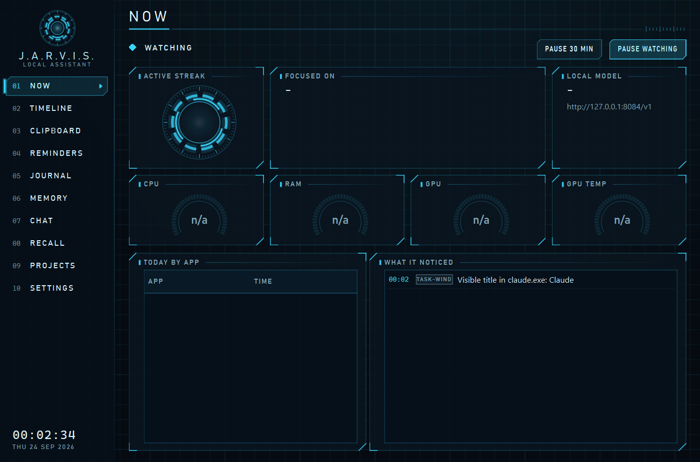
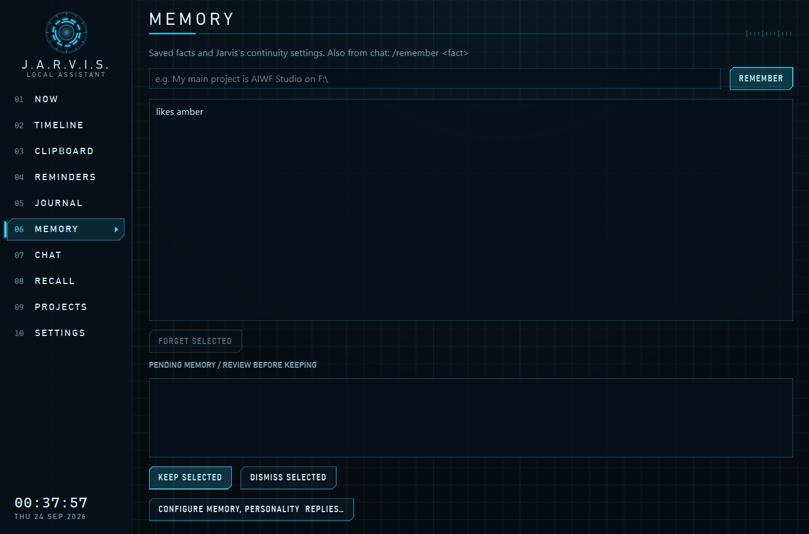
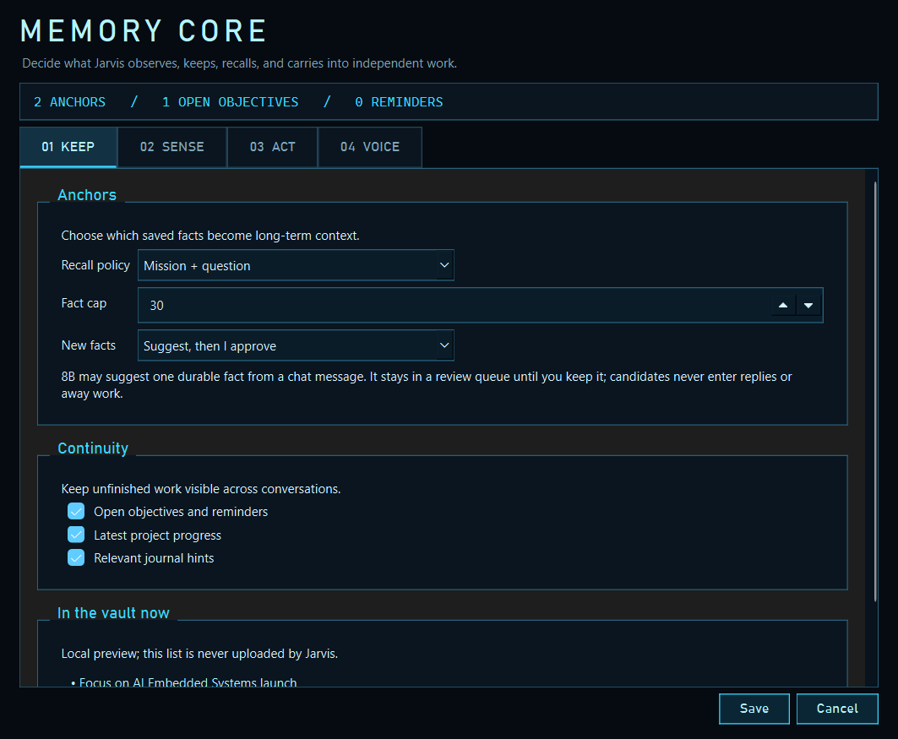
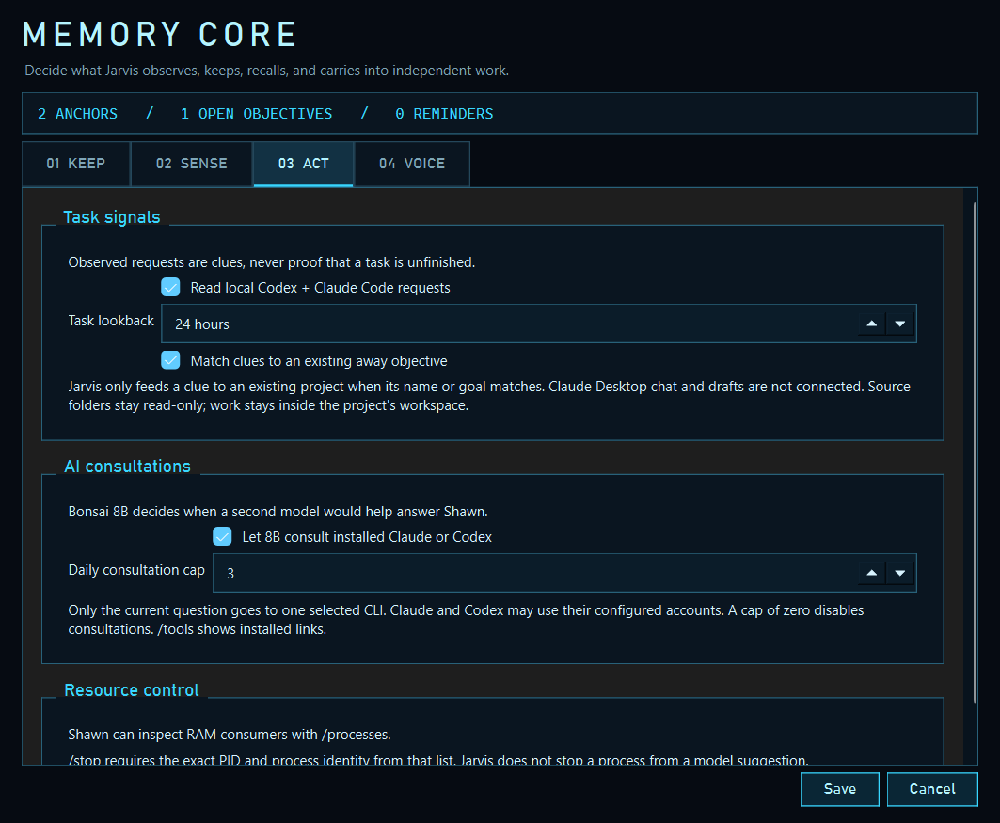

# Dani - Jarvis Assistant

[](https://github.com/nawnie/jarvis-assistant/actions/workflows/python-ci.yml)
[](https://github.com/nawnie/jarvis-assistant)
[](https://www.python.org/)
[](https://doc.qt.io/qtforpython-6/)
[](LICENSE)

Dani is the proposed project brand for Jarvis Assistant. The repository rename is pending; for now this project is hosted at [`nawnie/jarvis-assistant`](https://github.com/nawnie/jarvis-assistant), and the in-app name remains Jarvis Assistant. It is an experimental Windows tray app for local activity review, reminders, notes, search, and bounded project work, with a PySide6 desktop interface and configurable local-model features.

> **Early MVP:** deterministic tests cover selected core behavior. This showcase does not certify a fresh-profile install, live model inference, model recovery, or end-to-end phone integration. Screenshots use synthetic data and do not demonstrate live inference.

## Explore the app

- **Now** brings together mission, memory and tool status, system gauges, and recent events.
- **Timeline** presents recorded foreground-window activity in stretches, with idle gaps left out. Collection depends on the observation settings.
- **Clipboard** shows captured copied text. Capture skips windows that match the configured private-title or excluded-app rules.
- **Reminders** stores timed reminders and can show them from the tray when due while the app is running. Review the settings and runtime behavior before relying on it for critical alerts.
- **Journal** can create periodic activity summaries with the configured local model.
- **Memory** separates durable facts from observations and preferences. Model-proposed facts require explicit review before they become durable memory.
- **Chat** provides bounded commands for status, settings, files, objectives, tools, and processes. Process stopping requires an explicit process selection.
- **Recall** searches recorded windows, clipboard entries, journal entries, events, and chat history.
- **Projects** gives an explicit objective a bounded workspace. Selected source files can be read for context; writes stay in the project workspace. This is an experimental workflow, not unattended self-repair.

For the documented setup path, copy `config.example.json` into `data/config.json`: that sample disables observation and model startup. Missing settings fall back to code defaults that enable several sensors and model startup, so create and review the sample configuration before launching. Local runtime data belongs under `data/`, which Git ignores.

## Local model support

The app can be configured with local inference services. Its model configuration references [Ternary Bonsai 8B GGUF](https://huggingface.co/prism-ml/Ternary-Bonsai-8B-gguf) for conversation and memory suggestions, and [Ternary Bonsai 2 27B GGUF](https://huggingface.co/prism-ml/Ternary-Bonsai-2-27B-gguf) for optional away work. Model files and the inference server are not included in this repository.

The 27B self-repair workflow and automatic conversion of observations into independent objectives are planned work, not shipped features.

## Windows setup

1. Install Python 3.13 and create an environment: `py -3.13 -m venv .venv`.
2. Install dependencies: `.venv\Scripts\python.exe -m pip install -r requirements.txt`.
3. Create runtime settings: `mkdir data` then `copy config.example.json data\config.json`.
4. Review `data\config.json`. Add your own model paths only if using local inference. Observation and model startup are disabled by the sample configuration.
5. Start the app with `run.bat`; it stays in the tray when its window closes.

For the deterministic core checks, install the development dependencies and run:

```powershell
.venv\Scripts\python.exe -m pip install -r requirements-dev.txt
.venv\Scripts\python.exe -m pytest tests\test_core.py -q
```

The optional loopback API exposes bounded, typed actions and can be paired with a separate phone companion, which is not included here. This README does not claim phone-to-PC end-to-end acceptance.

## Screenshots

The checked-in captures were made from isolated UI test data on 2026-09-24. Their entries are synthetic; they are not evidence of real activity or live model inference.

| Now dashboard | Memory page |
|---|---|
|  |  |

| Memory Core: Keep | Memory Core: Act |
|---|---|
|  |  |

Additional views: [Chat](screenshots/chat.png), [Projects](screenshots/projects.png), [Settings](screenshots/settings.png).

## License and required credit

This project is distributed under the [PolyForm Noncommercial License 1.0.0](LICENSE). Commercial use requires separate permission from the project owner. This is source-available software with a noncommercial restriction, not an OSI open-source license.

When sharing any part of the licensed work, preserve the license terms and the required notice in [`NOTICE`](NOTICE):

> Required Notice: Jarvis Assistant Copyright 2026 Shawn (nawnie). Original project: https://github.com/nawnie/jarvis-assistant
